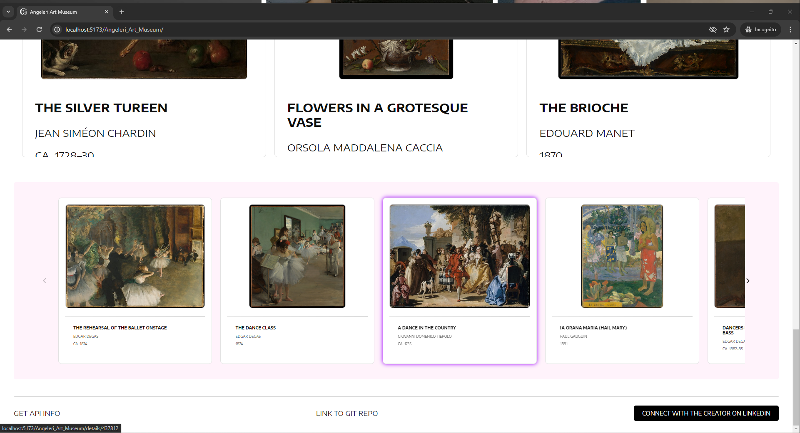
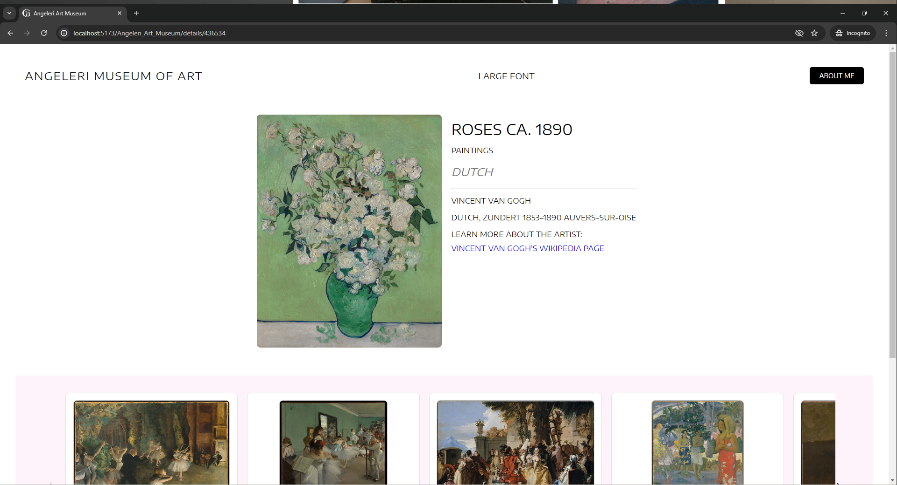
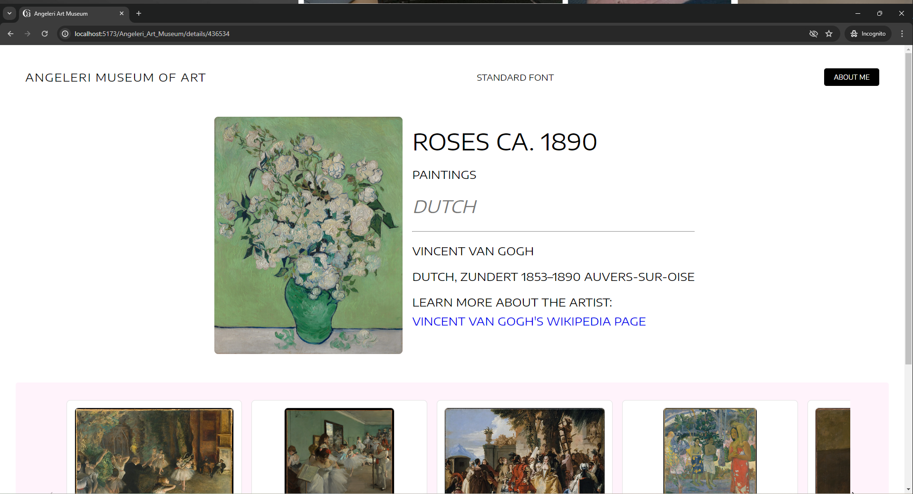
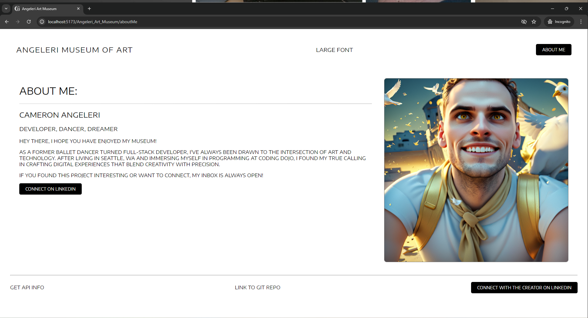

# Angeleri Art Museum: MERN Capstone 🎖️ (MongoDB, Express, React, Node.js)

This single-page museum was built and constructed with curiosity and care. Check out the latest deployment [here](insert-deployment-link).

*(Note: If the deployment is down and you would like to connect, please reach out to me [here](https://www.linkedin.com/in/cameron-angeleri/).)*

## Overview

Built on the Vite framework with PrimeReact Carousel and Custom CSS, Angeleri Art Museum showcases a fusion of modern web technologies and artistic appreciation. The project leverages an API connection through the Metropolitan Museum of Art to provide a rich and immersive experience for visitors.

## Techniques

- Responsive design achieved through a combination of Flexwrap, grid, and @media breakpoints.
- Global styling structure includes text manipulators, hover effects, and general styling to enhance user engagement and visual appeal.

## Installation

To run the project locally, follow these steps:
1. Download the Client.
2. Install Package JSON.
3. Run the app.

## Usage

Angeleri Art Museum is not just a showcase of art but also a journey of learning and connection through web development skills. Whether you're an art enthusiast or a fellow developer, feel free to explore the museum and connect with me via LinkedIn for feedback or collaboration opportunities.

## Screenshots

- Landing Page 

- Footer 

- Details Page 

- Details Page (Large Font) 

- About Me Page

- About Me Page 

## Example Code

While `App.jsx` provides a glimpse into the project structure, consider including more code snippets to highlight key features or implementations and inspire others to delve into the codebase.
